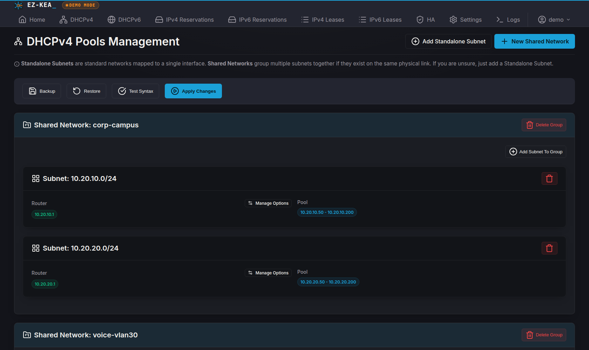

<p align="center">
  
</p>

<h1 align="center">EZ-KEA</h1>

<p align="center">
  A zero-config web interface for ISC Kea DHCP. Point it at your server and it finds your config.
</p>

<p align="center">
  <a href="https://github.com/fenleytech/ez-kea/releases"></a>
  <a href="LICENSE"></a>
  
  <a href="https://demo.ezkea.com"></a>
</p>



EZ-KEA gives ISC Kea a web UI without making you redo your setup. It looks in `/proc` for running `kea-dhcp4` and `kea-dhcp6` processes, finds the config file each one was started with, and edits that file directly. If Kea is not installed it creates a sandbox in `./data/` and runs in demo mode so you can try things out offline.

## Live demo

**<https://demo.ezkea.com>** — the login page comes with the demo account already filled in (`demo` / `demo`), just hit Sign In.

It is a shared sandbox with fake data and it resets every 30 minutes, so break whatever you want.

## Quick start

Requires **Python 3.10+**. Kea is optional — without it, EZ-KEA starts in demo mode. Kea **2.x and 3.x** are both supported, including 3.2, which dropped the Control Agent and ships no `keactrl`.

```bash
git clone https://github.com/fenleytech/ez-kea.git
cd ez-kea
python3 -m venv venv
source venv/bin/activate
pip install -r requirements.txt
python3 app.py
```

Open <http://127.0.0.1:8080> and log in with `admin` / `changeme`. It will make you change both right away.

By default it only listens on loopback. To let other machines reach it, set a real secret and a bind address. It will not start on a non-loopback address if `SECRET_KEY` is still the default:

```bash
export SECRET_KEY="$(python3 -c 'import secrets;print(secrets.token_hex(32))')"
export HOST=0.0.0.0
python3 app.py
```

## Security

This edits your production DHCP config, so a few things matter:

- Backs up your Kea configs before it writes
- Checks syntax before applying
- Runs as whatever user you start it as, no root needed if your file perms allow it
- Local accounts with optional TOTP two-factor, recovery codes, and SMTP password reset
- Binds to 127.0.0.1 by default and refuses to bind elsewhere until you set SECRET_KEY

If you are putting it behind a reverse proxy or running Kea in Docker, see the [Security hardening](https://github.com/fenleytech/ez-kea/wiki/Security-Hardening) and [Installation](https://github.com/fenleytech/ez-kea/wiki/Installation) guides in the wiki.

## Why EZ-KEA vs Stork

ISC Stork is a great tool if you are managing a fleet of Kea and BIND servers. It gives you central monitoring, HA status, pool utilization, and integrates with Postgres and Grafana. If you have many servers, Stork might be best for you.

EZ-KEA is different. It is for the admin who has a few Kea servers and is tired of hand editing JSON files.

- No agents, no database, no extra services
- Finds your config automatically by looking at running processes
- Edits the file Kea is actually running, with backup and syntax check
- A simple interface you can hand to a junior admin or anyone who prefers not to live in a JSON file

If that sounds like you, try EZ-KEA. It is completely free for noncommercial use, homelabs, and personal learning. Commercial use is $500 a year per deployment, and you can get a free 30 day eval to try it at work first.

## Features

- **Auto-discovery** finds running Kea daemons and uses their live config files. No paths to set up, but you can override them in the UI if you want.
- **IPv4 and IPv6** for shared networks, standalone subnets, pools, prefix delegation, and per-subnet options.
- **Reservations** MAC based for v4, DUID based for v6 with address and or prefix.
- **High availability** to set up Kea's `libdhcp_ha.so` hook with hot-standby, load-balancing, passive-backup and watch peer status live from the control socket.
- **Safe edits** that backup, restore, syntax check, and apply from the UI, then reload however your install expects — `keactrl`, the daemon's own control socket, or a SIGHUP for Docker setups.
- **Kea 2.x and 3.x** both work. EZ-KEA checks the version of the daemon it found and writes the matching control-socket syntax, so a config it generates is accepted by either.
- **Leases and logs** with active v4 and v6 lease tables and a searchable log viewer.
- **Multi-user auth** where admin accounts can manage users, licensing, and email settings.

Screenshots of the [leases](docs/images/leases.png), [reservations](docs/images/reservations.png), [IPv6 pools](docs/images/pools6.png), and [log viewer](docs/images/logs.png) views. Full feature list is in the [wiki](https://github.com/fenleytech/ez-kea/wiki).

## Running it for real

Systemd unit, reverse proxies, and non-standard Kea layouts are all in the [Installation guide](https://github.com/fenleytech/ez-kea/wiki/Installation).

## Licensing

EZ-KEA is source-available under [PolyForm Noncommercial 1.0.0](https://polyformproject.org/licenses/noncommercial/1.0.0).

In short:

- **Free for noncommercial use.** Everything included, no limits. That covers homelabs, personal use, learning, charities, schools, and government use.
- **Commercial use needs a license.** If it manages DHCP for a business or you get paid to run it for someone else, that is **$500 a year for a single deployment** — one production install, in one environment, run by one organization. Email **<sales@ezkea.com>**.
- **More than one deployment?** ISPs, MSPs, enterprises, and multi-site operators get volume licensing, priced on how many you run rather than off a list price. Email **<sales@ezkea.com>** with the number and I will quote it.
- **Want to try it at work first?** Free 30 day commercial eval, no questions asked. Email **<sales@ezkea.com>** and I will send you a trial key.

Unlicensed installs show a small note in the footer. It never blocks, degrades, or expires. It will not lock you out of your own config, licensed or not.

The [LICENSE](LICENSE) file is what counts, this is just a summary. More detail in [Licensing](https://github.com/fenleytech/ez-kea/wiki/Licensing).

SPDX identifier: `PolyForm-Noncommercial-1.0.0`. Source files have `SPDX-License-Identifier` headers so scanners pick it up. GitHub shows "Other" in the sidebar because its detector only knows OSI and FSF licenses.

## Documentation

The [wiki](https://github.com/fenleytech/ez-kea/wiki) has the rest:

| | |
| --- | --- |
| [Installation](https://github.com/fenleytech/ez-kea/wiki/Installation) | systemd, reverse proxies, Docker-based Kea |
| [Deployment scenarios](https://github.com/fenleytech/ez-kea/wiki/Deployment-Scenarios) | How it picks LIVE vs DEMO mode |
| [Configuration reference](https://github.com/fenleytech/ez-kea/wiki/Configuration-Reference) | All environment variables and UI overrides |
| [Security hardening](https://github.com/fenleytech/ez-kea/wiki/Security-Hardening) | Secret keys, 2FA, file perms |
| [High availability](https://github.com/fenleytech/ez-kea/wiki/High-Availability) | Setting up the HA hook |
| [Testbed](https://github.com/fenleytech/ez-kea/wiki/Testbed) | Containerized Kea for end-to-end testing |
| [Licensing](https://github.com/fenleytech/ez-kea/wiki/Licensing) | What is free, when you need to pay |

## Releases

Tagged releases are on the [Releases page](https://github.com/fenleytech/ez-kea/releases), and what changed in each is in [CHANGELOG.md](CHANGELOG.md). The running version is shown in the app footer, so you can tell what an install is on without checking out the repo.

## Support

- **Bugs and feature requests** — [GitHub Issues](https://github.com/fenleytech/ez-kea/issues)
- **Commercial licensing** — <sales@ezkea.com>

## Development

Tests run with no Kea install and no network:

```bash
pip install -r requirements.txt
python -m pytest
```

There is also a containerized Kea testbed that boots a real DHCP server on two virtual VLANs and runs actual DHCP transactions — see [testbed/README.md](testbed/README.md):

```bash
cd testbed && bash test_suite.sh
```

Bug reports and feature requests are welcome in [Issues](https://github.com/fenleytech/ez-kea/issues). I am not taking pull requests right now. Because EZ-KEA is sold under a commercial license too, merging code needs a licensing agreement with each contributor and that overhead is not worth it for a project this size. A good bug report helps more.

## License

[PolyForm Noncommercial 1.0.0](https://polyformproject.org/licenses/noncommercial/1.0.0) — see [LICENSE](LICENSE). Free for noncommercial use, commercial use needs a license, see [Licensing](#licensing) above.

